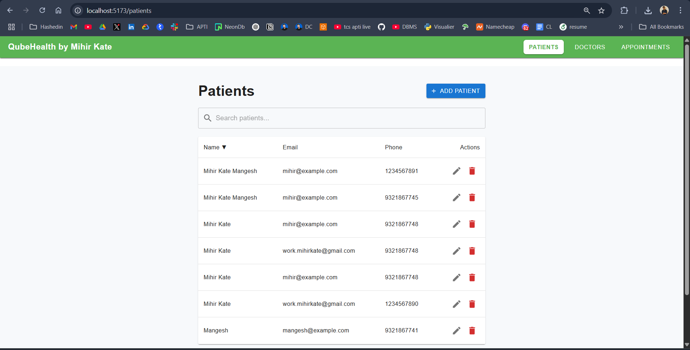
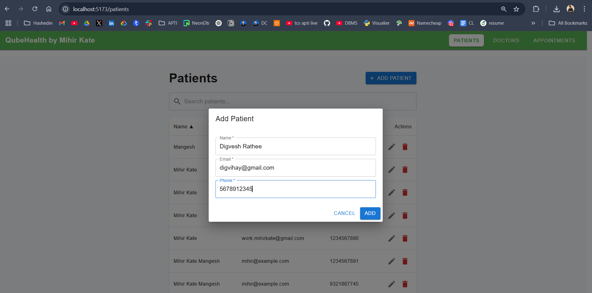
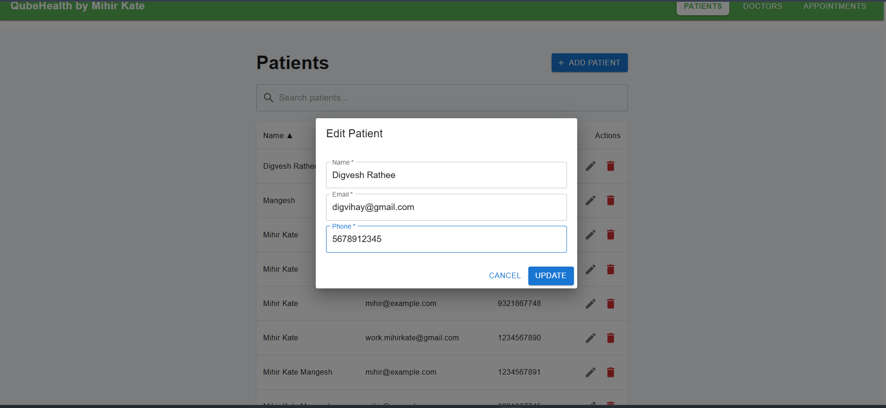
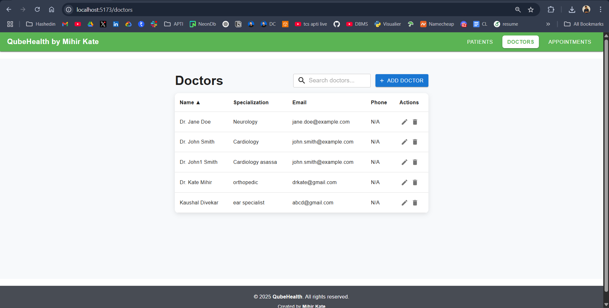
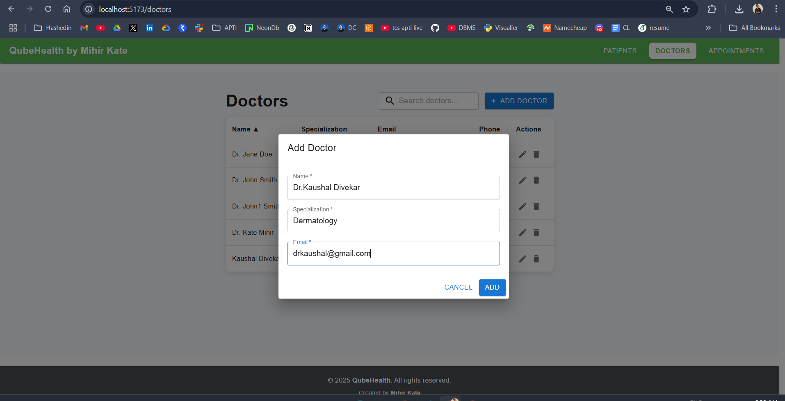
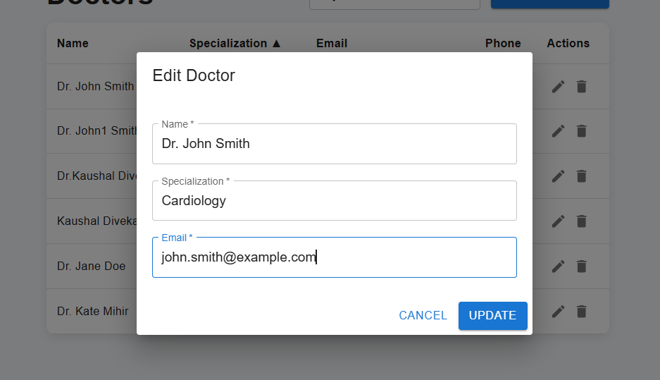
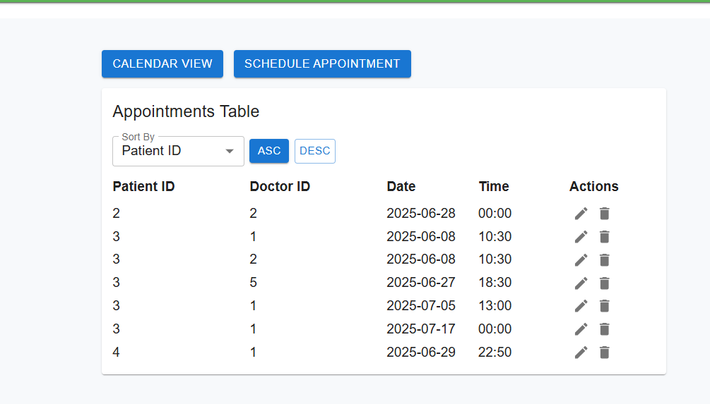
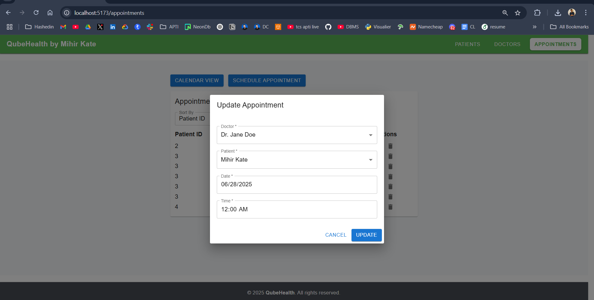
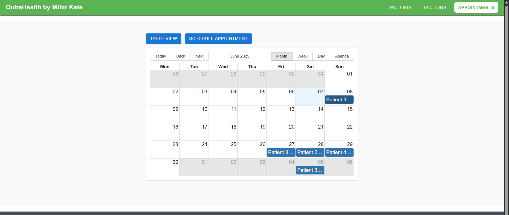

# QubeHealth Full Stack Project

This project is a full-stack healthcare management system with a React (Vite) frontend and a Spring Boot backend.

---
### 1.Patients

### add patient 
 
### update  patient 


### 2. Doctors endpoint 

### 

### 3. Appointment 

### 
### calendar view 


## 1. Running the Project on Localhost

The project has two main parts:
- **Frontend**: React app (Vite) in the `frontend` folder
- **Backend**: Spring Boot REST API in the `backend/backend-qube-health` folder

Both must be started separately.

---

## 2. Frontend Configuration

### Prerequisites
- [Node.js](https://nodejs.org/) (v18+ recommended)
- [npm](https://www.npmjs.com/) (comes with Node.js)

### Steps
1. Open a terminal and navigate to the frontend directory:
   ```powershell
   cd frontend
   ```
2. Install dependencies:
   ```powershell
   npm install
   ```
3. Start the development server:
   ```powershell
   npm run dev
   ```
4. Open your browser and go to [http://localhost:5173](http://localhost:5173)

---

## 3. Backend Configuration

### Prerequisites
- [Java 21](https://adoptium.net/) (or compatible JDK)
- [MySQL](https://www.mysql.com/) server running locally
- [Maven](https://maven.apache.org/) (or use the provided wrapper)

### Database Setup
1. Create a MySQL database named `qubehealth`:
   - Open your MySQL client and run:
     ```sql
     CREATE DATABASE qubehealth;
     ```
2. (Optional) Update DB credentials in `backend/backend-qube-health/src/main/resources/application.properties`:
   ```properties
   spring.datasource.username=YOUR_USERNAME
   spring.datasource.password=YOUR_PASSWORD
   ```
   Default is `root`/`root`.

### Steps
1. Open a terminal and navigate to the backend directory:
   ```powershell
   cd backend/backend-qube-health
   ```
2. Build the backend:
   ```powershell
   .\mvnw clean install
   ```
3. Run the backend server:
   ```powershell
   .\mvnw spring-boot:run
   ```
   The backend will start on [http://localhost:8081](http://localhost:8081)

4. API Documentation (if enabled):
   - Visit [http://localhost:8081/swagger-ui.html](http://localhost:8081/swagger-ui.html)

---

## 4. Useful Commands

**Frontend:**
- `npm run dev` — Start frontend dev server
- `npm run build` — Build frontend for production
- `npm run lint` — Lint frontend code

**Backend:**
- `.\mvnw spring-boot:run` — Start backend server
- `.\mvnw test` — Run backend tests

---

## 5. Troubleshooting
- Ensure MySQL is running and accessible.
- Make sure ports `5173` (frontend) and `8081` (backend) are free.
- If you change backend port or CORS settings, update the frontend API base URL in `frontend/src/api.js`.

---

## 6. Project Structure

```
QubeHealth/
  frontend/                # React + Vite frontend
  backend/
    backend-qube-health/   # Spring Boot backend
```

---

**Enjoy using QubeHealth!**
